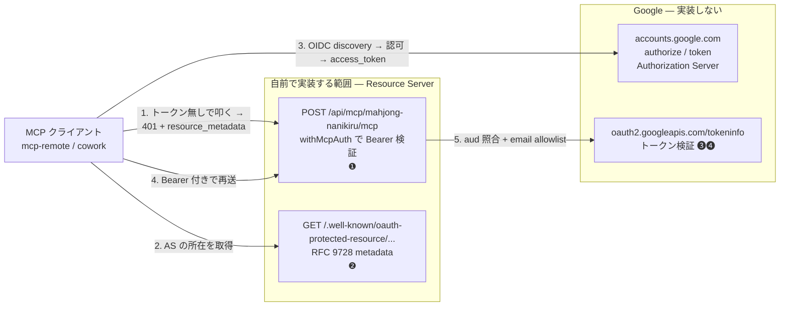
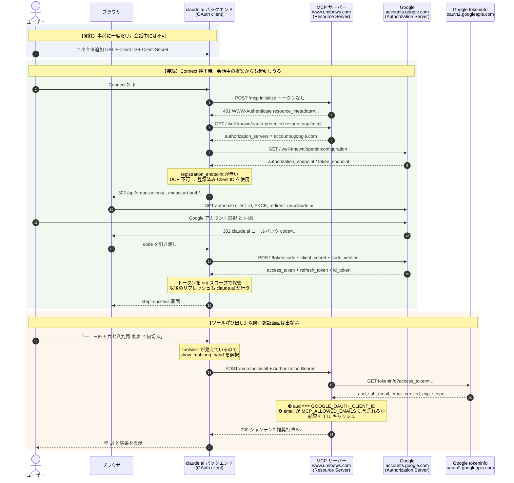
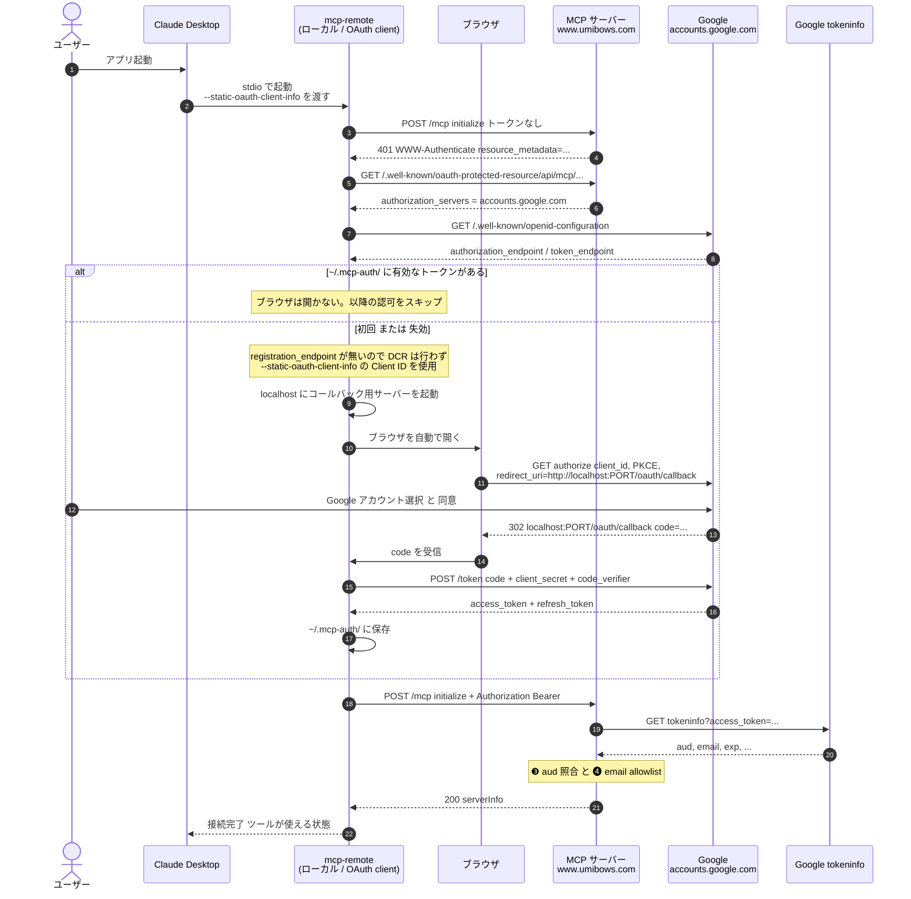
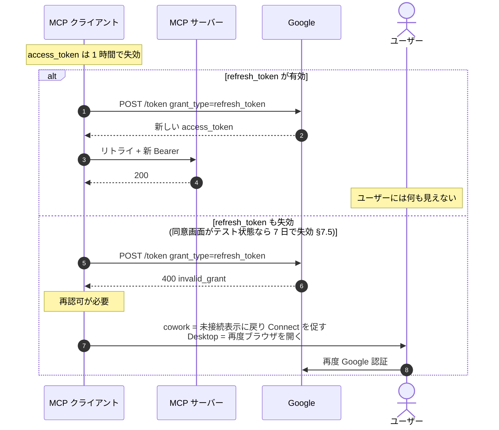
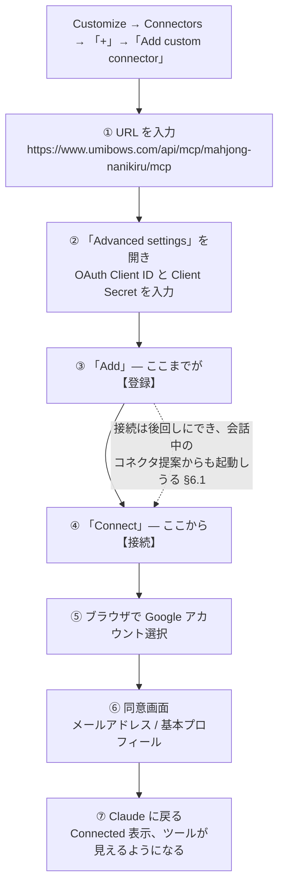
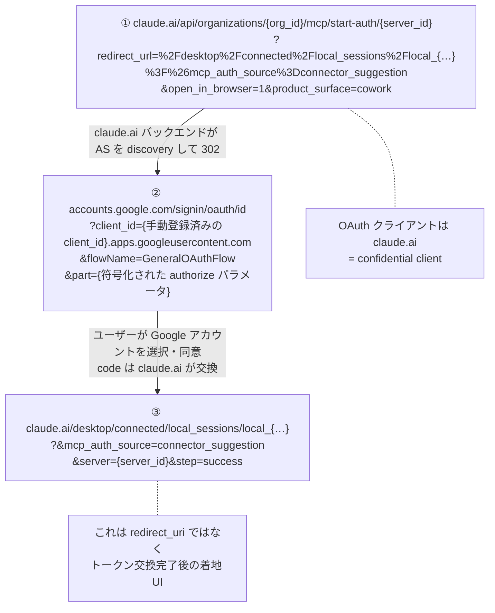

# mahjong-nanikiru — Remote MCP の Google OpenID Connect 認証 設計

remote MCP エンドポイント (`/api/mcp/mahjong-nanikiru/mcp`) の認証を、現在の
**共有トークン (`?key=`)** から **Google を IdP とした OAuth 2.1 / OpenID Connect** に
置き換えるための設計。

- 対象エンドポイント: `https://www.umibows.com/api/mcp/mahjong-nanikiru/mcp`
- 認可サーバー (AS): `https://accounts.google.com`
- MCP サーバーの役割: **Resource Server のみ**（AS は実装しない）
- 前提実装: `docs/mahjong-nanikiru/remote-mcp-deployment.md`

> ステータス: **実装済み**（§7.3 ワークアラウンド含む）。
> PRM を意図的に 404 にして `/.well-known/openid-configuration` 経由で discovery させる方式で mcp-remote での動作を確認済み。

---

## 1. なぜ `accounts.google.com` なのか（Google 製品の選定）

「Google Cloud の IdP」に該当しそうな製品は複数あるが、MCP の認可フローに使えるのは 1 つだけ。

| 候補                                                  | 使えるか    | 理由                                                                                                                         |
| ----------------------------------------------------- | ----------- | ---------------------------------------------------------------------------------------------------------------------------- |
| **Google as OIDC Provider** (`accounts.google.com`)   | ✅ **採用** | authorize / token エンドポイントを持つ本物の OAuth AS。OIDC discovery (`/.well-known/openid-configuration`) あり             |
| Google Cloud Identity Platform (GCIP / Firebase Auth) | ❌          | ID token を発行するだけ。サードパーティ MCP クライアント向けの authorize エンドポイントを持たず、OAuth AS として振る舞えない |
| Google Cloud IAP                                      | ❌          | Cloud Run / GAE / GCE / GKE の前段に置く製品。Vercel デプロイは保護できない                                                  |
| Workload / Workforce Identity Federation              | ❌          | GCP リソースへのアクセス用。自前アプリの保護用ではない                                                                       |

---

## 2. MCP 仕様上の役割分担

MCP 仕様 (2025-06-18 以降) では、**MCP サーバーは OAuth Resource Server であり、
自身が Authorization Server になってはいけない**。AS の場所は RFC 9728
(Protected Resource Metadata) で公示する。



**MCP サーバーから AS への直接通信は無い**（矢印が無い）。トークンの発行・更新は
すべてクライアントと Google の間で完結し、サーバーは受け取ったトークンを
tokeninfo で検証するだけ。

### 2.1 シーケンス図 — cowork / claude.ai（confidential client）

OAuth クライアントは **claude.ai のバックエンド**。トークンも Anthropic 側に保管される
（§6.5 の実測フローに対応）。



### 2.2 シーケンス図 — Claude Desktop + mcp-remote（public client / PKCE）

OAuth クライアントは**ローカルの mcp-remote プロセス**。redirect_uri は loopback。
トークンは `~/.mcp-auth/` にキャッシュされる。



> ⚠ **`--auth-timeout` 内にユーザーが認可を終えないと接続失敗扱いになる**（§6.4）。
> アプリ起動時に勝手にブラウザが開くのはこの経路（§6.3）。

### 2.3 トークン失効時（access token / refresh token）



---

## 3. 実装コンポーネント

追加パッケージは不要。既存の `mcp-handler@1.1.0` が RFC 9728 対応ヘルパーを持つ
（`withMcpAuth` / `protectedResourceHandler` / `generateProtectedResourceMetadata` /
`metadataCorsOptionsRequestHandler`）。

### ❶ 401 + `WWW-Authenticate` — `withMcpAuth`

`app/api/mcp/mahjong-nanikiru/[transport]/route.ts` の既存 `guarded` を置き換える。

```ts
import { withMcpAuth } from "mcp-handler";

const RESOURCE_METADATA_PATH = "/.well-known/oauth-protected-resource/api/mcp/mahjong-nanikiru/mcp";

const authed = withMcpAuth(handler, verifyGoogleToken, {
  required: true,
  resourceMetadataPath: RESOURCE_METADATA_PATH,
  // ⚠ withMcpAuth の resourceUrl は「オリジン」として使われる
  //    (実装: `${origin}${resourceMetadataPath}`)。フル URL を渡すとパスが二重になる。
  resourceUrl: "https://www.umibows.com",
});

export { authed as GET, authed as POST, authed as DELETE };
```

`resourceUrl` を明示するのは、Vercel のプロキシ配下で `req.url` が内部 URL になり
metadata URL が壊れるのを防ぐため（`x-forwarded-host` があれば自動検出も効くが、明示が確実）。

`withMcpAuth` が内部で行うこと（実装確認済み）:

- `Authorization: Bearer` を切り出して `verifyToken` に渡す
- `required: true` かつ `authInfo` が `undefined` → 401 + `WWW-Authenticate`
- `authInfo.expiresAt`（**秒** epoch）が過去 → 401
- `requiredScopes` を全て含まないと 403
- **`authInfo.resource` の突き合わせは行わない**（→ §7.3 に関連）

### ❷ Protected Resource Metadata エンドポイント（新規）

`app/.well-known/oauth-protected-resource/api/mcp/mahjong-nanikiru/mcp/route.ts`

```ts
import { protectedResourceHandler, metadataCorsOptionsRequestHandler } from "mcp-handler";

const handler = protectedResourceHandler({
  authServerUrls: ["https://accounts.google.com"],
  // ⚠ こちらの resourceUrl は「リソース識別子」。withMcpAuth とは意味が違うので
  //    フル URL を渡す。
  resourceUrl: "https://www.umibows.com/api/mcp/mahjong-nanikiru/mcp",
});

// ⚠ metadataCorsOptionsRequestHandler は「ハンドラを返すファクトリ」。
//    呼び出さずに export すると OPTIONS が壊れる。
const options = metadataCorsOptionsRequestHandler();

export { handler as GET, options as OPTIONS };
```

`resourceUrl` を省略すると `/.well-known/<segment>` を剥がして自動導出されるが、
プロキシ環境では明示しておくほうが安全。CORS ヘッダは両ハンドラが自前で付与する。

### ❸ トークン検証 — **JWKS ではなく tokeninfo**

ここが設計上いちばん誤解しやすい点。

> **Google の access token は JWT ではなく opaque 文字列であり、`aud` が
> こちらのリソースにならない。** したがって
> `https://www.googleapis.com/oauth2/v3/certs` の JWKS でローカル検証する設計は
> 成立しない。（JWKS で検証できるのは _ID token_ だが、MCP クライアントが
> `Authorization` ヘッダに載せるのは _access token_ である。）

Google の introspection 相当エンドポイントを使う。

```ts
import type { AuthInfo } from "@modelcontextprotocol/sdk/server/auth/types.js";

const ALLOWED_EMAILS = (process.env.MCP_ALLOWED_EMAILS ?? "")
  .split(",")
  .map((s) => s.trim())
  .filter(Boolean);

async function verifyGoogleToken(
  _req: Request,
  bearerToken?: string
): Promise<AuthInfo | undefined> {
  if (!bearerToken) return undefined;

  const cached = tokenCache.get(bearerToken);
  if (cached) return cached;

  const res = await fetch(
    `https://oauth2.googleapis.com/tokeninfo?access_token=${encodeURIComponent(bearerToken)}`
  );
  if (!res.ok) return undefined;

  const info = await res.json(); // { aud, sub, email, email_verified, exp, scope, ... }

  // ★ aud チェックは省略不可 (§7.4 confused deputy)
  if (info.aud !== process.env.GOOGLE_OAUTH_CLIENT_ID) return undefined;
  if (info.email_verified !== "true" && info.email_verified !== true) return undefined;
  if (!ALLOWED_EMAILS.includes(info.email)) return undefined;

  const authInfo: AuthInfo = {
    token: bearerToken,
    clientId: info.aud,
    scopes: String(info.scope ?? "")
      .split(" ")
      .filter(Boolean),
    expiresAt: Number(info.exp), // 秒 epoch。withMcpAuth が失効判定する
    extra: { sub: info.sub, email: info.email },
  };

  tokenCache.set(bearerToken, authInfo);
  return authInfo;
}
```

**キャッシュ**: tokeninfo をリクエスト毎に叩くと 1 往復増えるうえ Google 側のレート制限に触る。
アクセストークン文字列をキーに、TTL = `min(exp - now, 300s)` の in-memory キャッシュを置く。
上限 500 件で超過時は最古エントリを削除（`lib/mcp/google-token-cache.ts` 参照）。
Vercel Fluid Compute は関数インスタンスを再利用するので実効性がある
（インスタンス間では共有されない = 許容）。

### ❹ 認可（誰を通すか）

**Google は自前リソース向けのカスタムスコープを発行できない。** 取得できるのは
`openid` / `email` / `profile` のみなので、スコープベース認可は使えない。
`MCP_ALLOWED_EMAILS` による allowlist で代替する（❸ に組み込み済み）。

将来ツールが増えてスコープ分離が必要になったら §8 のブローカー案へ移行する。

---

## 4. ファイル構成

| ファイル                                                                         | 変更     | 役割                                                  |
| -------------------------------------------------------------------------------- | -------- | ----------------------------------------------------- |
| `app/api/mcp/mahjong-nanikiru/[transport]/route.ts`                              | 変更     | `guarded` → `withMcpAuth`。`verifyGoogleToken` を実装 |
| `app/.well-known/oauth-protected-resource/api/mcp/mahjong-nanikiru/mcp/route.ts` | **新規** | RFC 9728 metadata (GET / OPTIONS)                     |
| `lib/mcp/google-token-cache.ts`                                                  | **新規** | tokeninfo 結果の TTL キャッシュ                       |
| `middleware.ts`                                                                  | 変更     | matcher に `.well-known` の除外を追加（§7.2）         |

### 環境変数

| 変数                      | 用途                                                                                   |
| ------------------------- | -------------------------------------------------------------------------------------- |
| `GOOGLE_OAUTH_CLIENT_IDS` | tokeninfo の `aud` 突き合わせ用。Desktop 用・cowork 用をカンマ区切りで列挙（**必須**） |
| `MCP_ALLOWED_EMAILS`      | カンマ区切りの許可メール allowlist（**必須**）                                         |
| `MAHJONG_MCP_TOKEN`       | 既存の共有トークン。移行完了後に削除（§10）                                            |

`GOOGLE_OAUTH_CLIENT_SECRET` は **サーバー側では不要**。クライアント（mcp-remote /
cowork）が保持する。

---

## 5. Google Cloud Console 側の設定

1. OAuth 同意画面
   - User type: **External**
   - スコープ: `openid` / `userinfo.email` / `userinfo.profile` のみ（**非機微スコープ**）
   - **公開ステータスを「本番」にする** ← §7.5 の 7 日問題を回避するため必須。
     非機微スコープのみなので Google の審査 (verification review) は不要。
2. OAuth クライアント ID を作成。**クライアントの所在が 2 つで異なるため、種別も 2 つ必要**
   - **Claude Desktop (mcp-remote) 用**: 種別 **「デスクトップアプリ」**
     - OAuth クライアントは**ローカルの mcp-remote プロセス**。public client (PKCE)
     - loopback リダイレクトが任意ポートで許可されるため。「ウェブアプリ」だと
       `redirect_uri` のポート完全一致が要求され、mcp-remote の動的ポートと噛み合わない
   - **cowork / claude.ai 用**: 種別 **「ウェブアプリケーション」**
     - OAuth クライアントは **claude.ai のバックエンド**。confidential client
       （だから Advanced settings に Client Secret を入れる、§6.2 ②）
     - 承認済みリダイレクト URI には **claude.ai 上のコールバック URL** を登録する。
       localhost でも `www.umibows.com` でもない。正確な値は Google の
       `redirect_uri_mismatch` エラー画面に表示されるものを使うのが確実
       （§6.5 の実測フロー参照）

> Google Workspace 組織配下の GCP プロジェクトなら User type = **Internal** も選べる
> （審査不要・7 日制限なし・未確認アプリ警告なし）。ただしログインできるのが
> その組織のアカウントのみになり、個人ブログを組織の GCP に載せる話になるので、
> **個人 Google アカウント + External + 本番公開** を推奨。

---

## 6. クライアント設定と UX

### 6.1 認証のタイミング（重要）

2 段階に分けて考える。

| 段階               | 何をするか                                      | いつ                                                       |
| ------------------ | ----------------------------------------------- | ---------------------------------------------------------- |
| **登録**           | URL + OAuth Client ID / Secret を Claude に設定 | 事前。会話中には不可                                       |
| **接続 (Connect)** | 実際に Google 認可を通す                        | 後回し可。**会話中の「コネクタ提案」からもトリガーできる** |

`required: true` にすると `tools/list` も 401 になるため、**未認証状態では Claude は
ツールの存在自体を知らない**。したがって未接続コネクタに対して Claude ができるのは
「接続を促すこと」までで、認証せずにツールを呼ぶことはできない。

> 実測フロー (§6.5) の `mcp_auth_source=connector_suggestion` が、
> 会話中の提案から接続が始まるケースの実例。

### 6.2 cowork / claude.ai (custom connector)

初回（1 回のみ）:



2 回目以降: **認証画面は出ない。** 会話で「+」→ Connectors → トグル ON → プロンプト → 即実行。
access token は 1 時間で失効するが refresh token で裏側で自動更新され、ユーザーには見えない。

> ② の「Advanced settings」に Client ID / Secret 欄があることが、Google の
> **DCR 非対応 (§7.1) を cowork でも回避できる根拠**。公式ヘルプで確認済み:
> <https://support.claude.com/en/articles/11175166-about-custom-connectors-remote-mcp>

### 6.3 Claude Desktop (mcp-remote ブリッジ)

こちらは **アプリ起動時**に認証が走る（起動 → 401 → ブラウザが自動で開く）。
トークンは `~/.mcp-auth/` にキャッシュされ、2 回目以降の起動では何も出ない。

`claude_desktop_config.json`:

```json
"mahjong-nanikiru": {
  "command": "npx",
  "args": [
    "-y",
    "mcp-remote",
    "https://www.umibows.com/api/mcp/mahjong-nanikiru/mcp",
    "--static-oauth-client-info",
    "{\"client_id\":\"...apps.googleusercontent.com\",\"client_secret\":\"GOCSPX-...\"}"
  ]
}
```

`--static-oauth-client-info` は mcp-remote 0.1.38 に実在（`dist` のフラグ一覧で確認済み）。
関連フラグ: `--static-oauth-client-metadata` / `--auth-timeout` / `--header` / `--debug`。

### 6.4 失効時の見え方（劣化パス）

| クライアント | 挙動                                                                                                                                                           |
| ------------ | -------------------------------------------------------------------------------------------------------------------------------------------------------------- |
| cowork       | コネクタが未接続表示に戻る。会話中に失効した場合はツール呼び出しがエラーになり、Claude が「ツールにアクセスできない」と報告する。設定から「Connect」を押し直す |
| Desktop      | mcp-remote が再度ブラウザを開く。`--auth-timeout` 内に認証しないと接続失敗扱い                                                                                 |

### 6.5 cowork の実測フロー（他サーバーでの観測）

Google を IdP にした別の MCP サーバーを cowork に接続したときの実際の遷移。
本設計の裏付けとして記録する。



読み取れること:

| 観測                                                | 意味                                                                                                                                                      |
| --------------------------------------------------- | --------------------------------------------------------------------------------------------------------------------------------------------------------- |
| ① が `claude.ai/api/.../start-auth` から始まる      | OAuth クライアントは **claude.ai のバックエンド**。confidential client。トークンは Anthropic 側に org スコープで保管され、リフレッシュも claude.ai が行う |
| ② に実在の `client_id` が載っている                 | **手動登録したクライアントが使われている** = DCR は使われていない (§7.1 の結論と整合)                                                                     |
| ② が `flowName=GeneralOAuthFlow`                    | 標準の authorization code フロー                                                                                                                          |
| ① に `open_in_browser=1` / `product_surface=cowork` | cowork がシステムブラウザを開く                                                                                                                           |
| ① / ③ の `mcp_auth_source=connector_suggestion`     | 会話中のコネクタ提案から接続が始まった (§6.1)                                                                                                             |

読み取れ**ない**こと:

- **③ は OAuth の `redirect_uri` ではない。** トークン交換完了後の着地 UI。
  Google に登録すべき URI はこれではない
- **Google が AS 本体なのか、ブローカーの AS が Google に federate しているのか区別できない。**
  アドレスバー上はどちらも `accounts.google.com` に見える。判別するにはその
  サーバーの `/.well-known/oauth-protected-resource` を叩いて
  `authorization_servers` を見る
- **`resource` パラメータが送られたかどうか（§7.3）。** ② は中間ページで、
  元の authorize パラメータは `part=` に符号化されている

---

## 7. 落とし穴

### 7.1 Google は Dynamic Client Registration に非対応（最大の制約）

Google の OIDC metadata に `registration_endpoint` がなく、MCP SDK は

```
Incompatible auth server: does not support dynamic client registration
```

を投げて停止する（`@modelcontextprotocol/sdk` の `client/auth.js` で確認）。
→ **クライアントを手動作成し、静的に注入する**（§5, §6.2 ②, §6.3）。

### 7.2 Basic 認証ミドルウェアが `.well-known` を巻き取る

`middleware.ts` の matcher は現在 `api/auth` / `api/mcp` / `_next/static` / `_next/image` /
`favicon.ico` のみ除外。RFC 9728 の metadata は **ルート直下の `/.well-known/...`** に
置く必要があるため、現状では `/api/auth` に rewrite され、認証フローが始まらない。

```ts
// middleware.ts — matcher に .well-known を追加
matcher: [
  "/((?!api/auth|api/mcp|\\.well-known|_next/static|_next/image|favicon.ico).*)",
],
```

### 7.3 RFC 8707 `resource` パラメータ（**確認済み NG → ワークアラウンド適用済み**）

`@modelcontextprotocol/sdk` は authorize / token 両方のリクエストに `resource=` を付与する
（`client/auth.js` の `authorizationUrl.searchParams.set('resource', …)` /
`tokenRequestParams.set('resource', …)` で確認）。

**mcp-remote で実測した結果、Google の token エンドポイントが `resource` パラメータ付きのリクエストに `400 Bad Request` を返すことを確認**（`InvalidGrantError: Bad Request`）。

**ワークアラウンド（実装済み）**: PRM エンドポイントを意図的に 404 にし、代わりに
`/.well-known/openid-configuration` で Google の OIDC メタデータをプロキシする。
この経路では SDK の `selectResourceURL` が `resourceMetadata=undefined` を受け取り
`resource` パラメータを送らなくなる。

> ⚠ **cowork (claude.ai) はバックエンド独自実装のため別途検証が必要。**
> mcp-remote でのワークアラウンドが cowork でも有効かどうかは未確認。
> cowork の実装が `resource` を送るかどうかは §6.5 の観測では確認できなかった。

§8 のブローカー案への切り替えは、ツールが増えてスコープ分離が必要になった時点か、
cowork でも NG が確認された時点で検討する。

なお `withMcpAuth` は `authInfo.resource` の突き合わせを行わないので、
サーバー側で `resource` を埋める必要はない（❸ では省略している）。

### 7.4 `aud` チェックを省略すると confused deputy

tokeninfo が 200 を返しただけで通してしまうと、**まったく別の Google OAuth アプリで
取得した access token でこちらのサーバーが通る**。`info.aud === GOOGLE_OAUTH_CLIENT_ID`
の検証は必須。

### 7.5 同意画面が「テスト」だと refresh token が 7 日で失効

publishing status が「テスト」のままだと refresh token の寿命が 7 日になり、
**毎週手動で再認証させられる**。加えてテストユーザーの事前登録が必要で、
未確認アプリの警告画面も踏む。

→ **同意画面を「本番」に公開する**（非機微スコープのみなので審査不要, §5）。

---

## 8. 代替案: 自前 AS / ブローカーを挟む

Google を upstream にした自前 AS、または Clerk / Auth0 / WorkOS / Descope を挟み、
**自前の JWT (`aud` = MCP リソース URL) を発行**する構成。MCP 仕様が本来想定する形。

|                    | Google 直接（本設計）                 | ブローカー経由        |
| ------------------ | ------------------------------------- | --------------------- |
| DCR                | ✗ 手動クライアント登録 (§7.1)         | ✓ 自動                |
| トークン検証       | tokeninfo へ HTTP（キャッシュで緩和） | ✓ JWKS でローカル検証 |
| RFC 8707 resource  | 非対応（無視される想定, §7.3）        | ✓ 準拠                |
| スコープ設計       | 不可（email allowlist）               | ✓ 任意スコープ        |
| refresh token 寿命 | 本番公開が必須 (§7.5)                 | ✓ 自前制御            |
| 追加インフラ       | なし                                  | 必要                  |

**本件では Google 直接を採用。** 個人ブログの read-only ツール 1 個に対して
ブローカーは過剰。ツールが増えてスコープ分離が要る、あるいは §7.3 が NG になった
時点で移行する。

---

## 9. 検証順序

実装前に 2 を潰す。ここが本設計の唯一の不確定要素。

1. Google Cloud Console でデスクトップアプリ型 OAuth クライアントを作成、同意画面を本番公開
2. **`resource` パラメータ付きの authorize リクエストが Google に通るか手で確認** (§7.3)
   → NG なら §8 に切り替え
3. ❷ metadata エンドポイント + `middleware.ts` 除外を入れ、`curl` で 200 / JSON を確認

   ```bash
   curl -s https://www.umibows.com/.well-known/oauth-protected-resource/api/mcp/mahjong-nanikiru/mcp
   # → {"resource":"https://www.umibows.com/api/mcp/mahjong-nanikiru/mcp",
   #    "authorization_servers":["https://accounts.google.com"]}
   ```

4. ❶ 401 + `WWW-Authenticate` ヘッダを確認

   ```bash
   curl -si -X POST https://www.umibows.com/api/mcp/mahjong-nanikiru/mcp \
     -H 'content-type: application/json' -H 'accept: application/json,text/event-stream' \
     -d '{"jsonrpc":"2.0","id":1,"method":"initialize","params":{"protocolVersion":"2025-06-18","capabilities":{},"clientInfo":{"name":"t","version":"1"}}}' \
     | head -20
   # → HTTP/2 401 / WWW-Authenticate: Bearer error="invalid_token", …, resource_metadata="…"
   ```

5. mcp-remote で end-to-end（`--debug` 付きで OAuth の各ステップを確認）
6. cowork の custom connector で end-to-end

---

## 10. 現状からの移行

現在 `MAHJONG_MCP_TOKEN` が **本番未設定** = エンドポイントは無認証で公開状態。
（サイト本体は Basic 認証で守られているが、`/api/mcp` はミドルウェア除外のため素通し。）

1. **先に `MAHJONG_MCP_TOKEN` を production に設定して塞ぐ**（本設計の完成を待たない）
2. OAuth 実装を投入。移行期間は「トークン一致 **または** Google 認証成功」で許可する
   （`verifyGoogleToken` の先頭で `?key=` を見て、一致すれば固定の `AuthInfo` を返す）
3. 全クライアントの移行完了後、`?key=` 分岐と `MAHJONG_MCP_TOKEN` を削除

---

## 11. 既知の制約

- **カスタムスコープ不可**: Google は自前リソース向けスコープを発行できないため、
  ツール単位の権限分離ができない。全許可 or 全拒否（email allowlist）のみ。
- **tokeninfo 依存**: トークン検証に Google への外向き HTTP が必要。Google 側の
  障害時は MCP も落ちる。キャッシュ TTL の範囲では耐える。
- **1 リソース = 1 クライアント種別ではない**: Desktop 用（デスクトップアプリ型）と
  cowork 用（ウェブアプリ型）で client_id が分かれるため、`aud` チェックは
  **許可 client_id のリスト**に対する照合へ拡張が必要になる可能性がある。
- **`tools/list` も 401**: 未認証クライアントにはツールが 1 つも見えない。
  これは仕様どおりの挙動だが、「コネクタを追加したのにツールが出ない」という
  症状は認証未完了を意味する、と理解しておく必要がある。

---

## 12. 検証済み事項の出典

| 事項                                                            | 確認方法                                                                             |
| --------------------------------------------------------------- | ------------------------------------------------------------------------------------ |
| `mcp-handler@1.1.0` の auth ヘルパー群                          | `node_modules/mcp-handler/dist/index.d.mts` / `index.mjs`                            |
| `withMcpAuth` の `resourceUrl` = オリジン扱い                   | `index.mjs` の `` `${origin}${resourceMetadataPath}` ``                              |
| `protectedResourceHandler` の `resourceUrl` = リソース識別子    | `index.mjs` の `protectedResourceHandler` 実装                                       |
| `metadataCorsOptionsRequestHandler` はファクトリ                | `index.mjs`（`return () => …`）                                                      |
| `withMcpAuth` が `resource` を検証しない                        | `index.mjs` の分岐一覧（`expiresAt` と `requiredScopes` のみ）                       |
| SDK が OIDC discovery にフォールバックする                      | `@modelcontextprotocol/sdk` `client/auth.js` の `.well-known/openid-configuration`   |
| SDK が `resource` パラメータを送る                              | 同 `client/auth.js`（authorize / token 両方）                                        |
| DCR 非対応 AS でエラーになる                                    | 同 `client/auth.js` の `Incompatible auth server: …`                                 |
| `AuthInfo` の形（`expiresAt` は秒 epoch）                       | `@modelcontextprotocol/sdk/server/auth/types.d.ts`                                   |
| mcp-remote の `--static-oauth-client-info`                      | mcp-remote 0.1.38 の `dist` フラグ一覧                                               |
| cowork の Advanced settings に Client ID/Secret 欄              | <https://support.claude.com/en/articles/11175166-about-custom-connectors-remote-mcp> |
| cowork の OAuth クライアントが claude.ai バックエンドであること | §6.5 の実測フロー（他サーバーでの観測）                                              |
